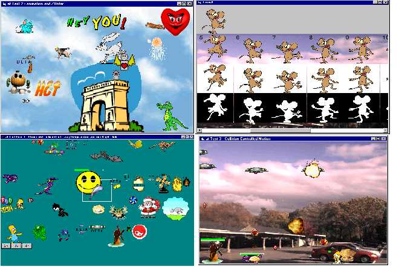



## Animated Graphics Exercises

### Description

This sample should be very interesting for those of you who have tried to code graphic games in VB. While main point of demo is using a new control which could be described as "transparent animated gif control", the demo itself could teach you some techniques useful in game-programming. Mouse-activated objects, dragging, transparency operations understanding, "intelligence" in sprite motions and collisions testing as well as some basic Windows GDI functions and more. Take a look yourself - I hope it worth to. To be honest, I should say that main purpose of this post is to get some feedbacks about new control from you pals. So don't hesitate to mail me your thoughts and suggestions. You'll decide if this control will be developed to more "professional" state than it is now. BTW, zip contains a bunch of nice animated gifs to give you "field to play with". Hope you won't blame me for this if you're on slow connection ;)
 
### More Info
 
Solid knowledge of ActiveX controls is necessary(from _using_ point of view, not _creating_ them) and at least basic knowledge of graphics in VB.

             |
---                |---
**Submitted On**   |2000-11-08 21:19:24
**By**             |[Dmitry Apukhtin](https://github.com/Planet-Source-Code/PSCIndex/blob/master/ByAuthor/dmitry-apukhtin.md)
**Level**          |Advanced
**User Rating**    |4.9 (44 globes from 9 users)
**Compatibility**  |VB 6\.0
**Category**       |[Graphics](https://github.com/Planet-Source-Code/PSCIndex/blob/master/ByCategory/graphics__1-46.md)
**World**          |[Visual Basic](https://github.com/Planet-Source-Code/PSCIndex/blob/master/ByWorld/visual-basic.md)
**Archive File**   |[CODE\_UPLOAD114971182000\.zip](https://github.com/Planet-Source-Code/dmitry-apukhtin-animated-graphics-exercises__1-12658/archive/master.zip)

